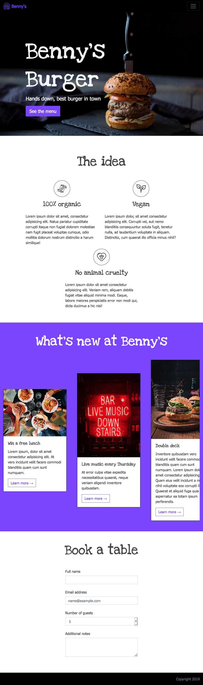
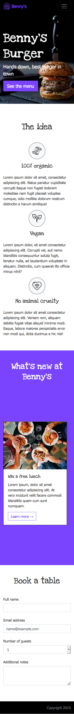

# Benny's burger

> Let's use Bootstrap and SCSS to create a restaurant page!
> This exercise focuses mainly importing files, variables, @mixin, and @extend topics.
> font family for heading: https://fonts.google.com/specimen/Love+Ya+Like+A+Sister

Create a mockup website as seen in [this reference](https://hsnakk.github.io/scss_exer_2/).

## Desktop:

* site header is sticky to the top 
* add scroll to section - on click on the items in the menu, scroll to section 

## Tablet

## Mobile

